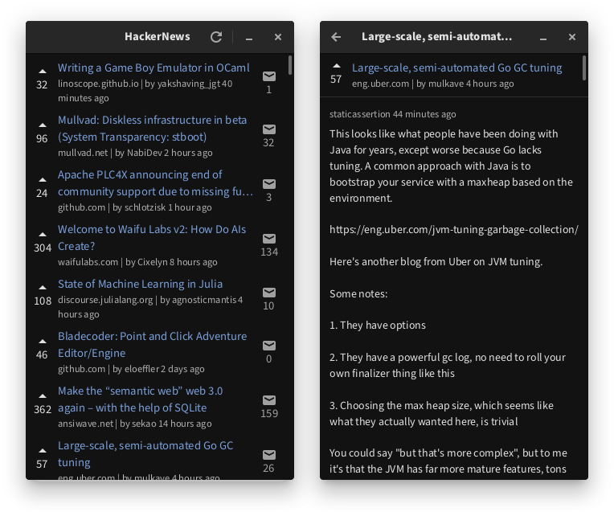

# hackernews

A HackerNews reader written in Go and GTK4.



## Package Structure

```
- internal/
	- components/    -- where all components are
		- frontpage/ -- listings for all posts
		- postview/  -- comment view for a post
	- hackernews/    -- HackerNews API client
		- hnhtml/    -- HTML renderer for Pango Markup
	- gtkutil/       -- GTK utility package
```
